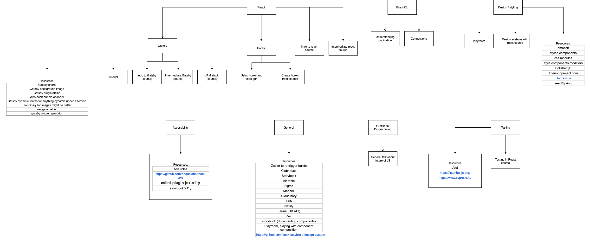

# Learning Path

This repo is just designed to be a place where you can view my current learning path

## State of it right now

## The order of things

The order of the things that I learnt does not really matter that much. This is just my journey and what I feel I need to work on.

## What is covered

It is a mixed bag, I am right now mainly focusing on

- React and most popular plugins etc
- Gatsby
- Serverless
- Design systems
- Personal projects to practice skills learnt
- General dev stuff in conference videos

I use this "learning path" to just stay up to date with all the changes which is why there is no need to do it in order. I cover many things from detailed courses to just "look at netlify"

## So why the repo then?

It is more for me so I do not loose track of the links, resources and things I take note of as I learn but also for anyone else who may find value in the things I have found out there.

## How to use it

[Here](https://docs.google.com/spreadsheets/d/1AE_pTdam834bY3tTOUYwoBClUhHo1IqwUCSte5XpACc/edit?usp=sharing) is the google doc with the list of things that are currently being done. There is also a tab on the sheet for notes, which is an informal list of notes taken while watching courses etc. These notes could also be just the name of something.

[Here](https://drive.google.com/file/d/1goXerxrahl2MmfpI_cyDzN8Kk1rEbc3o/view?usp=sharing) Is a diagram of the topics grouped by subject / tech

Many of the learning courses are done on [Front end Masters](http://frontendmasters.com). I would really advise getting an account there if you want to stay up to date with all things in the front end world.

The list of the things I have done contains the tasks I did, the topic that I covered and some links so they should be self explanatory.

